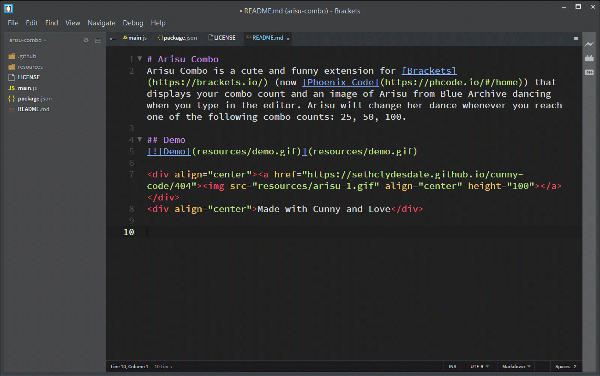

# Arisu Combo

Arisu Combo is a cute and funny extension for [Brackets](https://brackets.io/) (now [Phoenix Code](https://phcode.io/#/home)) that displays your combo count and an image of Arisu from Blue Archive dancing when you type in the editor. Arisu will change her dance whenever you reach one of the following combo counts: 25, 50, 100.

## Demo

## How to Install

1. [Download](https://github.com/SethClydesdale/arisu-combo/archive/refs/heads/main.zip) or clone this repo locally.
2. Unzip Arisu Combo and open Brackets.
3. Click "Help" in the title bar and then "Show Extensions Folder" from the drop down.
4. Open the "user" folder and drop the arisu-combo folder into the "user" folder.
5. Click "debug" in the title bar and then "Reload With Extensions" form the drop down.
6. Enjoy cute and funny while you code.

Made with Cunny and Love

